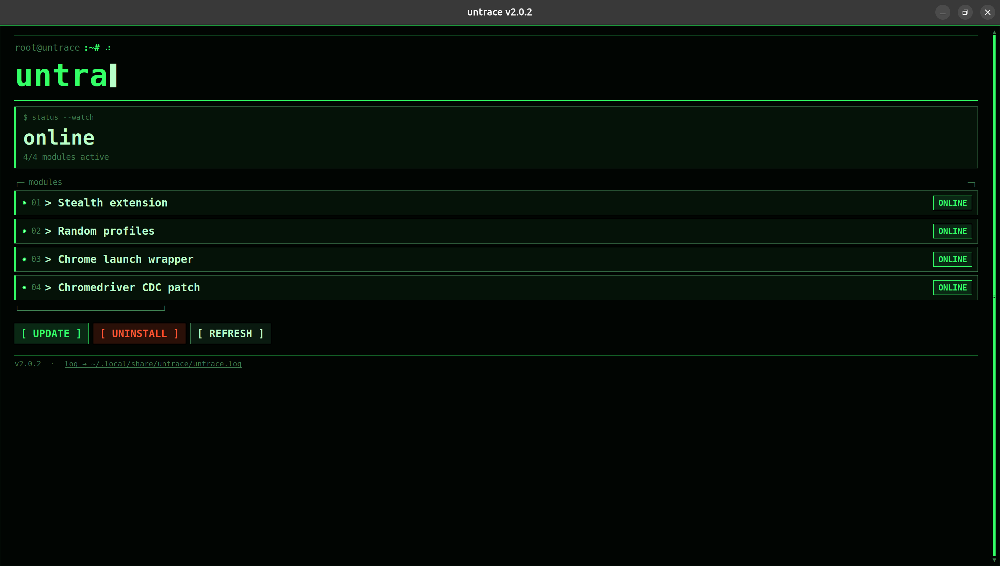
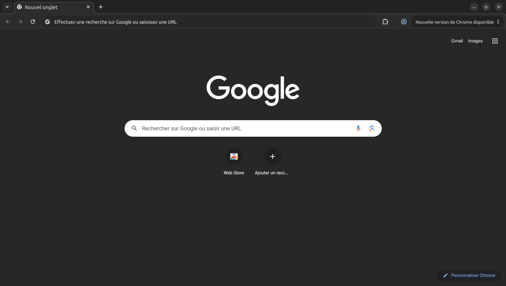

# Untrace

<p align="center">
  
</p>

Untrace is a system-level stealth stack for Chrome. Install it once, then use the browser normally. No custom flags, no extra extensions in your project, no profile scripts to maintain.

It ships as three modules you can toggle at install time. The **stealth extension** patches common bot-detection signals in the page. The **launch wrapper** gives every Chrome start a fresh random profile and anti-detection launch flags. The **chromedriver CDC patch** strips automation fingerprints from chromedriver binaries on disk.

You don't need to keep asking whether your setup is stealthy enough. Untrace wires it in at the OS level.

**Untrace GUI**

<p align="center">
  
</p>

**Fresh Chrome profile**

<p align="center">
  
</p>

## Modules

| Module | Flag |
|--------|------|
| Stealth extension | `--stealth-extension` |
| Random profiles / Chrome launch wrapper | `--launch-wrapper` |
| Chromedriver CDC patch | `--chromedriver-cdc` |

## Install

### Linux

```bash
sudo python3 -m untrace --install
python3 -m untrace --status
sudo python3 -m untrace --uninstall
```

### Windows

```powershell
python -m untrace --install
python -m untrace --status
python -m untrace --uninstall
```

On Windows, Smart App Control / WDAC may block the unsigned wrapper (`WinError 4551`).

## Development

```bash
uv sync --group dev
uv run task lint
uv run task test
uv run task test-browser   # needs a prior --install
```
